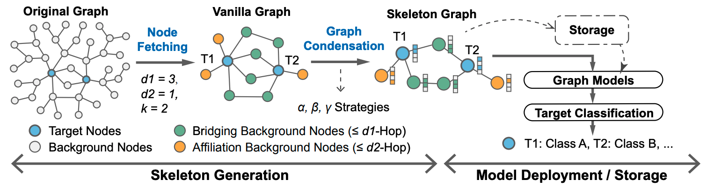

# Graph-Skeleton

This repository is for "Graph-Skeleton: Less than 2% Nodes are Sufficient to Represent
Billion-Scale Graph [[arXiv]](https://openreview.net/forum?id=dU73Mgx7xm&referrer=%5Bthe%20profile%20of%20Haoran%20Deng%5D(%2Fprofile%3Fid%3D~Haoran_Deng2))" accepted by **WWW2024**.

## Overview




### Install

Install libboost

```shell
sudo apt-get install libboost-all-dev
```

### Compile

Compile Graph-Skeleton

```shell
mkdir build
cd build
cmake ..
make
cd ..
```

### Data Download

The currently code demo is based on the dataset [DGraph](https://dgraph.xinye.com/dataset). Please unizp the dataset folder and organize as follows:
```
.
--DGraphFin
   └─dgraphfin.npz
```

### GraphS-Skeleton Generation
To generate skeleton graphs, a graph compressio script is provided. Please note that in our original paper, hyper-parameters "d1", "d2" are set as 2 and 1, you can also modify the setting of "d" in the script to change the node fetching distance. This script will generate three different sekeleton graphs (i.e., $\alpha$, $\beta$ and $\gamma$).


<!-- 
## Dependencies

- Python (3.8.3)
- PyTorch (>=1.6.0)

 (see `setup.py` for the full list)


## Installation
**From source**:

```bash
git clone https://github.com/caolinfeng/OoDHDR-codec OodHDR_codec
cd OodHDR_codec
pip install -U pip && pip install -e .
```

## Data Download

SDR training datasets can be downloaded from:
- [DIV2K](https://data.vision.ee.ethz.ch/cvl/DIV2K)
- [Flickr2K](http://cv.snu.ac.kr/research/EDSR/Flickr2K.tar)

HDR training datasets (.hdr) can be downloaded from:
- [HDRIHEVEN](https://hdrihaven.com/hdris/)
- [pfstools (HDR Image Gallery)](http://pfstools.sourceforge.net/hdr_gallery.html)
- [HDRLabs](http://www.hdrlabs.com/sibl/archive/)
- [Funt and Shi 2010](https://www2.cs.sfu.ca/~colour/data/funt_hdr/)

Evaluation datasets:
- [HDR (Google Drive)](https://drive.google.com/drive/folders/1U_GN4UARkLFve3UjvRhNKs56z6dcH-WI?usp=sharing)
- [SDR-Kodak](http://r0k.us/graphics/kodak/)

## Usage

### Training

A training script with a regularization & fusion loss is provided in
`examples/train_ood.py`. Please specify the corresponding HDR & SDR datasets in the file. The custom ImageFolder structure in our project only supports for the RGBE (.hdr) input currently.

You can run the script for a training pipeline:

```bash
python examples/train_ood.py --lambda 12 --epochs 250 --cuda --save --gpu 0,1,2,3 --batch-size 32 --rw 1e-5 --pw 2 --sdr_w 0.95 
```
> **Note:** 'rw, pw, sdr_w' are the hyper-parameters of the constructed loss. To achevie the optimal performance of a certain network, it is recommended to use the grid search.
You can also modify other parameters to change the model and training strategy in the file or cmd.

### Evaluation

To evaluate a trained model on HDR and SDR dataset, evaluation scripts (`examples/test_hdr.py`, `examples/test_sdr.py`) are provided. Please modify the testing dataset path in the corresponding file, and specify the trained model path in cmd: 

```bash
python examples/test_hdr.py --pth /XXX.pth.tar
```
```bash
python examples/test_sdr.py --pth /XXX.pth.tar
```

* The PyTorch pre-trained models can be downloaded [here (Google Drive)](https://drive.google.com/drive/folders/1FPUvTdN0JkoNJjm3FHDyrdPtLrddUxOm?usp=sharing)

### Quality Assessement

To assess the compression performance on HDR images, the evaluation metrics of puPSNR, puSSIM and HDR-VDP (3.0.6) are used, the source codes (Matlab version) can be [downloaded here](http://resources.mpi-inf.mpg.de/hdr/vdp/). 

## Citation

If you find this code useful, please cite our paper:

```
@inproceedings{Cao2020OodHDR,
  title     = {OoDHDR-Codec: Out-of-Distribution Generalization for HDR Image Compression},
  author    = {Linfeng Cao, Aofan Jiang, Wei Li, Huaying Wu and Nanyang Ye},
  booktitle = {Proceedings of the Thirty-Sixth AAAI Conference on Artificial Intelligence (AAAI)},
  year      = {2022}
}
```

## Related link
 * This project is developed based on [CompressAI library](https://github.com/InterDigitalInc/CompressAI)
 -->
